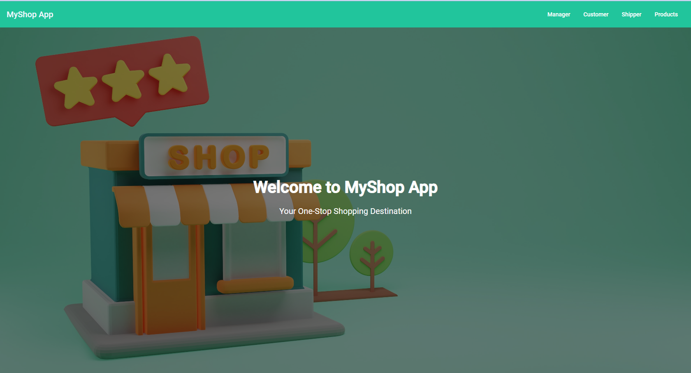
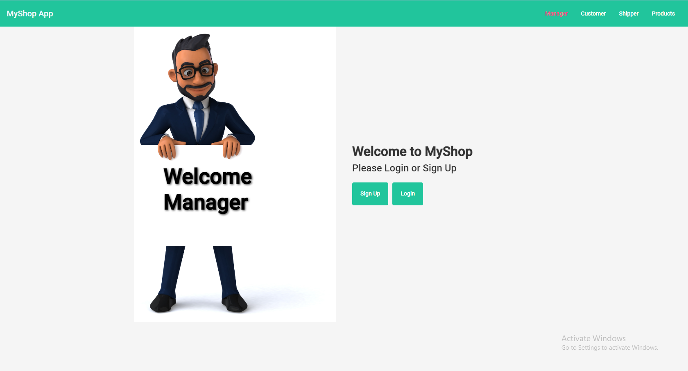
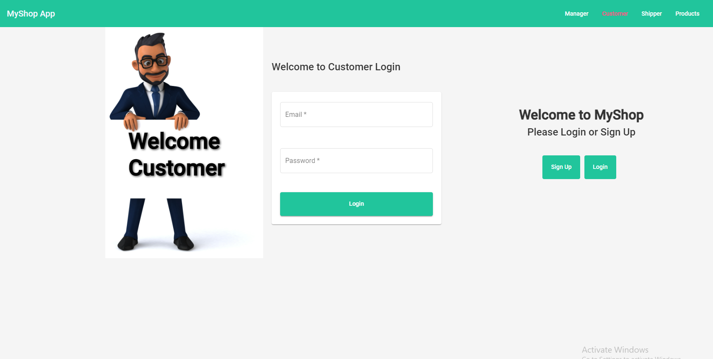
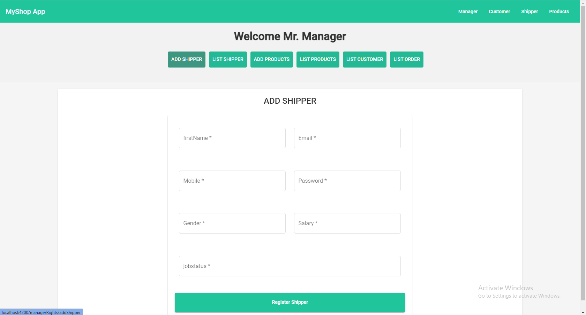
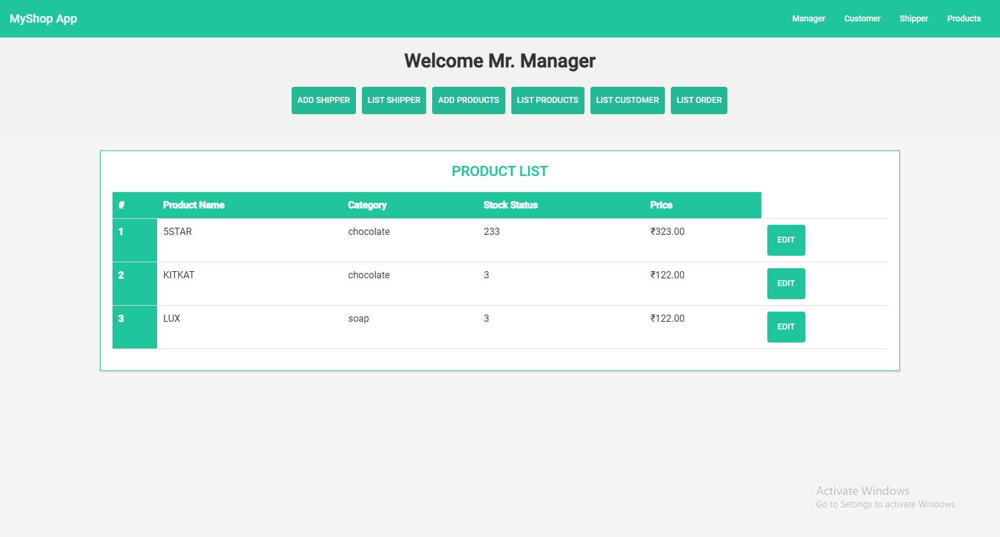

# Angular Shopping Website

The Angular Shopping Website is a feature-rich e-commerce platform that provides three dashboards for different user roles: Manager, Shipper, and Customer. This website enables seamless online shopping experiences, allowing customers to browse and purchase products, managers to manage products and users, and shippers to handle order deliveries. The application incorporates authentication, authorization guards, and Angular Material components to enhance security and user interface consistency.

## Screenshots

Below are some screenshots of the website:

- **Homepage**:
  

- **Manager Dashboard**:
  

- **Customer Login Page**:
  

- **Add Shipper Page**:
  

- **Product Listing**:
  

## Features

- **Manager Dashboard**: Managers have access to features such as adding products, managing users, viewing orders, and performing CRUD operations on products, shippers, and customers.
- **Shipper Dashboard**: Shippers can view assigned orders, update delivery times, and manage their own profile information.
- **Customer Dashboard**: Customers can browse products, place orders, view their order history, and manage their profile details.
- **Product Listing**: The website displays a visually appealing product listing, providing customers with essential information like product images, descriptions, and prices.
- **Authentication**: The application incorporates authentication mechanisms to ensure secure access to different dashboards and protect user data.
- **Authorization Guards**: Angular's authorization guards are implemented to control user access based on their assigned roles.
- **Angular Material**: Angular Material components are utilized for consistent and responsive UI design throughout the application.

## Prerequisites

Before running the application, ensure you have the following software installed:

- Node.js: [https://nodejs.org](https://nodejs.org)
- Angular CLI: Install globally using `npm install -g @angular/cli`

## Installation

1. Clone this repository to your local machine:

   ```bash
   git clone https://github.com/your-username/angular-shopping-website.git
   ```

2. Navigate to the project directory:

   ```bash
   cd angular-shopping-website
   ```

3. Install the project dependencies:

   ```bash
   npm install
   ```

## Usage

To run the application locally, execute the following command:

```bash
ng serve
```

The application will be accessible at [http://localhost:4200](http://localhost:4200) in your web browser.

## Deployment

To deploy the application to a production environment, follow these steps:

1. Build the application using the Angular CLI:

   ```bash
   ng build --prod
   ```

2. The build artifacts will be stored in the `dist/` directory. You can then deploy these files to your preferred hosting platform.

## Contributing

Contributions to the Angular Shopping Website are welcome! If you encounter any issues or have suggestions for improvements, please open an issue on the [GitHub repository](https://github.com/your-username/angular-shopping-website/issues).

If you'd like to contribute code, please follow these steps:

1. Fork the repository and clone it locally.
2. Create a new branch for your feature or bug fix.
3. Make your changes and commit them with descriptive commit messages.
4. Push your changes to your fork.
5. Submit a pull request to the main repository.

## License

This project is licensed under the MIT License. See the [LICENSE](LICENSE) file for more information.
